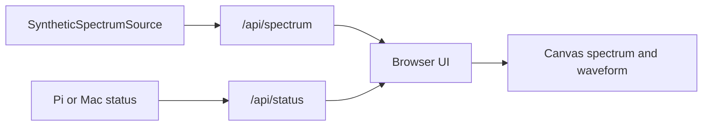

# Observatory Web App

This is the first browser-based Signal Observatory instrument surface.

It starts with a synthetic spectrum source so the API, frontend, and instrument workflow can be built before the RTL-SDR arrives.

## Scientific Question

Can a browser read synthetic spectrum data from a local instrument server and update the display like a live observatory dashboard?

## Current Architecture



The important design idea is that the UI reads a data shape, not a hardware-specific driver.

Later:

```text
SyntheticSpectrumSource -> RtlSdrSpectrumSource
```

The web UI should not need to know which source created the spectrum frame.

## Run On The Mac

From the repository root:

```bash
python3 apps/observatory_web/server.py
```

Open:

```text
http://127.0.0.1:8000
```

## Run On The Raspberry Pi Later

When your Mac and Raspberry Pi are back on the same local network:

```bash
cd ~/Code/signalobservatory
git pull
python3 apps/observatory_web/server.py --host 0.0.0.0 --port 8000
```

Then open this from your Mac browser:

```text
http://signal-observatory.local:8000
```

## API Endpoints

```text
GET /api/status
GET /api/spectrum
```

`/api/status` returns host and runtime information.

`/api/spectrum` returns:

- synthetic signal source name
- sample rate
- FFT size
- bin spacing
- expected tones
- detected peaks
- time-domain waveform points
- frequency-domain spectrum bins

## What To Notice

- The browser refreshes data every second.
- The time-domain waveform is one mixed signal.
- The spectrum separates that signal into frequency peaks.
- The 1 kHz tone appears stronger than the 10 kHz tone.
- This is the same mental model a live SDR spectrum analyzer will use.

## Next Steps

1. Add a `sources/` module so synthetic, file, and RTL-SDR sources share one interface.
2. Add a short learning log for the first web dashboard run.
3. Replace polling with WebSockets once the data shape feels stable.
4. Add a waterfall view.
