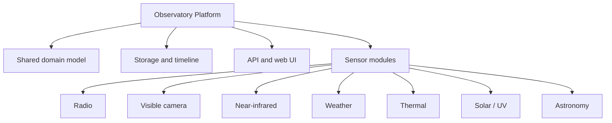

# Modular Observatory Platform Architecture

This document describes the target architecture direction for Signal Observatory as it evolves toward The Invisible Observatory.

It is a planning document, not an implementation spec. Use it to guide future backend, API and UI decisions.

## Core Principle

The platform should be generic. Sensor-specific behavior should live in modules.



The shared platform should own:

- observatory management
- device registration
- sensor registration
- capture sessions
- measurement metadata
- file storage references
- derived metrics
- observations
- experiments
- calibration status
- timeline queries

Modules should own:

- sensor-specific configuration
- ingestion adapters
- raw data formats
- processing pipelines
- derived metrics
- visualizations
- detection algorithms

## Domain Model

### Observatory

Represents a physical or logical observation station.

Suggested fields:

- id
- name
- description
- latitude
- longitude
- altitude
- timezone
- createdAt
- updatedAt

### Device

Represents a computing device connected to an observatory.

Examples:

- Raspberry Pi
- Mac development machine
- mini PC
- remote server
- embedded controller

Suggested fields:

- id
- observatoryId
- name
- deviceType
- hostname
- status
- lastSeenAt
- metadata
- createdAt
- updatedAt

### Sensor

Represents an instrument connected to a device.

Examples:

- RTL-SDR
- RGB camera
- Raspberry Pi NoIR camera
- thermal camera
- weather sensor
- UV sensor
- spectrometer

Suggested fields:

- id
- deviceId
- name
- sensorType
- manufacturer
- model
- serialNumber
- spectralRangeMin
- spectralRangeMax
- unit
- configuration
- calibrationData
- calibrationStatus
- status
- createdAt
- updatedAt

### CaptureSession

Groups measurements from one observation period or experiment.

Examples:

- five-minute radio scan
- daily plant image sequence
- night-sky capture
- weather monitoring period
- multispectral experiment

Suggested fields:

- id
- observatoryId
- name
- description
- startedAt
- endedAt
- status
- tags
- metadata
- createdAt
- updatedAt

### Measurement

Generic record for a sensor measurement.

Suggested fields:

- id
- sensorId
- captureSessionId
- measurementType
- capturedAt
- duration
- rawDataUri
- processedDataUri
- previewUri
- metadata
- calibrationStatus
- qualityScore
- createdAt

Radio metadata example:

```json
{
  "centerFrequencyHz": 100000000,
  "sampleRateHz": 2400000,
  "gainDb": 32,
  "fftSize": 4096
}
```

Image metadata example:

```json
{
  "width": 1920,
  "height": 1080,
  "exposureMs": 12,
  "iso": 200,
  "lens": "6mm",
  "spectralBand": "NIR"
}
```

Weather metadata example:

```json
{
  "temperatureC": 21.4,
  "humidityPercent": 63,
  "pressureHpa": 1017.2
}
```

### DerivedMetric

Stores values calculated from measurements.

Examples:

- detected radio peak
- signal strength
- noise floor estimate
- average scene temperature
- cloud coverage
- sky brightness
- UV index
- anomaly score

Suggested fields:

- id
- measurementId
- metricType
- value
- unit
- confidence
- metadata
- calculatedAt

### Observation

Stores a human-, rule-, model- or AI-generated observation.

Suggested fields:

- id
- observatoryId
- captureSessionId
- measurementId
- authorType
- title
- description
- severity
- confidence
- evidence
- createdAt

Author types:

- human
- rule-engine
- machine-learning-model
- language-model

## Module Interface Direction

When implementation begins, each module should eventually answer:

- What sensor types does it support?
- What measurement types does it produce?
- What raw data formats does it write?
- What processed previews does it create?
- What derived metrics can it calculate?
- What visualization components does it need?
- What calibration metadata does it require?

Conceptual shape:

```text
module
  id
  supportedSensorTypes
  supportedMeasurementTypes
  ingest()
  process()
  summarize()
  visualize()
```

This is not a requirement to create an abstraction immediately. It is a guide for avoiding tight coupling.

## Storage Strategy

Different sensors produce very different data sizes.

Examples:

- weather reading: bytes
- image: megabytes
- thermal image: hundreds of kilobytes
- IQ recording: hundreds of megabytes or more
- hyperspectral cube: potentially very large

Separate:

- relational metadata
- raw files
- processed files
- preview files
- calibration files

Conceptual layout:

```text
observatories/
  {observatoryId}/
    sensors/
      {sensorId}/
        raw/
        processed/
        previews/
        calibration/
```

Use local storage first. Keep the path model compatible with later cloud object storage.

## Unified Timeline

The Unified Timeline is a core product concept.

It should query measurements near a target time:

```text
target timestamp +/- configurable window
```

Example:

```text
18:43:00
+-- radio-spectrum measurement
+-- visible-image measurement
+-- weather measurement
+-- observation with evidence links
```

Timeline capabilities can grow over time:

- chronological navigation
- zoom by minute, hour, day and week
- filter by sensor
- filter by measurement type
- compare two moments
- display observations and anomalies

## API Direction

Future API routes should support:

- observatories
- devices
- sensors
- capture sessions
- measurements
- derived metrics
- observations
- experiments
- timeline queries

Example route families:

```text
/api/observatories
/api/devices
/api/sensors
/api/capture-sessions
/api/measurements
/api/metrics
/api/observations
/api/experiments
/api/timeline
```

Do not add all endpoints before there is a real use case. Add them incrementally as modules require them.

## UI Direction

Future navigation may include:

- Overview
- Timeline
- Live
- Sensors
- Experiments
- Observations
- Data Explorer
- Settings

Early UI should stay smaller. The first radio module can still begin with a focused spectrum view, but it should not prevent a later Timeline or Sensors view.

## Migration Principle

The first implementation should not be a large architectural rewrite.

Preferred path:

1. Keep learning experiments lightweight.
2. Bring up Raspberry Pi and RTL-SDR hardware.
3. Build radio spectrum analyzer as first module.
4. Introduce the generic domain model when backend storage begins.
5. Add Unified Timeline once at least radio plus one other measurement type exists or can be seeded.

The architecture should become more generic as real pressure appears, not before.
