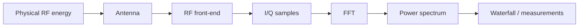
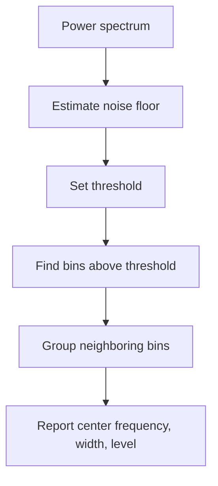
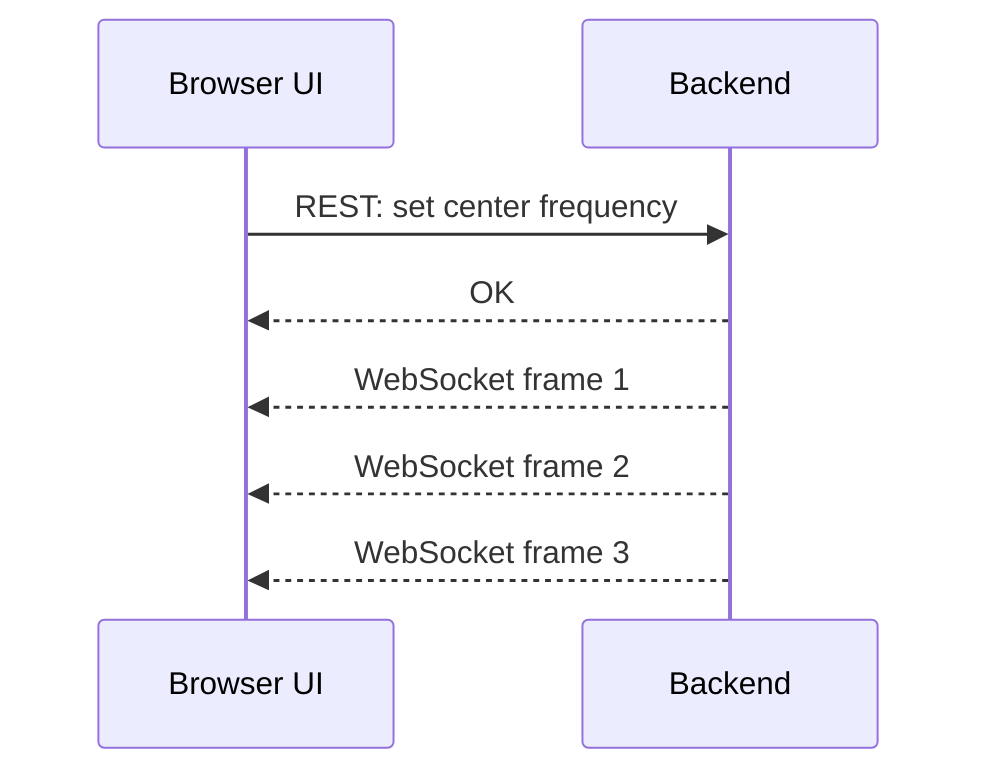

# SDR Spectrum Analyzer Theory Primer

This primer explains the theory behind Phase 1 before we build the spectrum analyzer.

The Phase 1 app will eventually show a live spectrum and waterfall, but those displays are only the end of a longer measurement chain:



The purpose of Phase 1 is to understand every arrow in that chain.

## How To Read This Primer

For each concept, look for six things:

1. Intuition: the plain-language idea.
2. Vocabulary: the proper technical terms.
3. Visual: a diagram or sketch.
4. Math: the small equation that matters.
5. Consequence: what changes in the measurement.
6. Experiment: how we can prove it.

If a concept is still fuzzy after reading, that is useful information. It means we should build a smaller experiment before writing application code.

## 1. The Big Picture

An audio system and an SDR system are cousins.

```text
Audio measurement chain

air pressure -> microphone -> preamp -> ADC -> samples -> spectrum analyzer

RF measurement chain

radio waves  -> antenna    -> tuner  -> ADC -> I/Q samples -> spectrum analyzer
```

Both chains convert a physical phenomenon into electrical measurements, then into numbers, then into a visualization.

| Audio world | SDR world | Shared idea |
| --- | --- | --- |
| microphone | antenna | transducer from physical energy to voltage |
| preamp gain | RF gain | make a signal easier to measure |
| clipping | front-end overload | too much level corrupts measurement |
| sample rate | sample rate | snapshots per second |
| spectrogram | waterfall | frequency content over time |
| noise floor | noise floor | baseline energy below useful signal |

The new part is frequency range. Audio is usually about 20 Hz to 20 kHz. SDR deals with radio frequencies that may be millions or billions of cycles per second.

## 2. What A Signal Is

Intuition:

A signal is a changing quantity that carries information or energy.

In audio, the changing quantity is air pressure. In radio, the changing quantity is an electromagnetic field.

A simple signal can be modeled as a sine wave.

```text
amplitude
^
|        / \        / \        / \
|       /   \      /   \      /   \
|------/-----\----/-----\----/-----\----> time
|    /         \ /         \ /
|   /           V           V
```

Vocabulary:

- amplitude: how large the signal is
- frequency: how many cycles happen per second
- phase: where the cycle is at a specific moment
- period: how long one cycle takes

Math:

```text
period = 1 / frequency
frequency = 1 / period
```

Example:

```text
1 kHz audio tone:
frequency = 1,000 cycles/second
period    = 1 / 1,000
          = 0.001 seconds
          = 1 ms
```

For radio, a 100 MHz FM broadcast carrier cycles 100,000,000 times per second.

```text
100 MHz carrier:
frequency = 100,000,000 cycles/second
period    = 1 / 100,000,000
          = 0.00000001 seconds
          = 10 ns
```

Consequence:

The computer cannot directly process a 100 MHz sine wave as ordinary audio. The SDR has to tune and shift a slice of RF spectrum down to a form the ADC and computer can handle.

Experiment:

Generate a 1 kHz sine wave in Python and plot it. Then generate a 10 kHz sine wave at the same sample rate and see how the cycles get closer together.

## 3. Frequency, Wavelength, And Antennas

Intuition:

Frequency tells us how fast a wave oscillates. Wavelength tells us how far the wave travels during one cycle.

```text
one wavelength
<----------->

    / \         / \
   /   \       /   \
--/-----\-----/-----\---->
 /       \   /       \
/         \ /         \
```

Math:

```text
wavelength = speed_of_light / frequency
```

The speed of light is approximately:

```text
300,000,000 meters/second
```

Example:

```text
FM broadcast near 100 MHz:

wavelength = 300,000,000 / 100,000,000
           = 3 meters

quarter-wave antenna length ~= 3 / 4
                            ~= 0.75 meters
```

This is why antennas have physical size. A small antenna can still receive, but it may be inefficient or poorly matched for the frequency.

Consequence:

When we tune to different bands, antenna length, orientation, and placement matter. If the spectrum looks empty, the problem might be the antenna, not the code.

Experiment:

When the RTL-SDR arrives, tune to FM broadcast and adjust the telescoping dipole length. Watch how signal peaks change.

## 4. What The SDR Front-End Does

Intuition:

The SDR is a radio receiver that converts a chosen part of the RF spectrum into numbers.

It does not receive all radio frequencies at once. It receives a window around a selected center frequency.

```text
full RF world

|---- AM ----|--------- FM ---------|--------- ADS-B ---------|---- more ---->
             88 MHz              108 MHz                    1090 MHz

SDR tuned near 100 MHz

             98.8 MHz      100.0 MHz      101.2 MHz
                |-------------|-------------|
                        visible slice
```

Vocabulary:

- center frequency: the frequency placed at the middle of the observed slice
- sample rate: how many I/Q samples per second the SDR sends
- bandwidth/span: how wide the visible frequency window is
- gain: amplification before conversion to samples
- front-end: the analog radio hardware before the samples exist

Typical Phase 1 example:

```text
center frequency = 100.0 MHz
sample rate      = 2.4 MS/s

visible span ~= 2.4 MHz

left edge  ~= 98.8 MHz
center     = 100.0 MHz
right edge ~= 101.2 MHz
```

Consequence:

If you want to observe a signal at 101.1 MHz, you can tune the SDR center to 100.0 MHz and see that signal near the right side of the spectrum. If you want 1090 MHz ADS-B, you must tune near 1090 MHz.

Experiment:

With a known FM station, tune the center frequency slightly below and above the station. Watch the station peak slide left and right on the spectrum.

## 5. Baseband And Frequency Offsets

Intuition:

The SDR shifts the selected RF slice down so the computer can work with it.

After tuning, the center frequency becomes 0 Hz in the sample stream. Frequencies are represented as offsets from center.

```text
RF view:

98.8 MHz                  100.0 MHz                  101.2 MHz
  |--------------------------|--------------------------|

baseband view after tuning:

-1.2 MHz                    0 Hz                    +1.2 MHz
  |--------------------------|--------------------------|
```

Vocabulary:

- RF: radio frequency, the actual frequency in the air
- baseband: the shifted signal centered around 0 Hz
- frequency offset: distance from the tuned center

Math:

```text
display_frequency = center_frequency + frequency_offset
```

Example:

```text
center_frequency = 100.0 MHz
frequency_offset = +0.7 MHz

display_frequency = 100.7 MHz
```

Consequence:

The FFT initially sees offsets like -500 kHz or +700 kHz. The UI converts those offsets back into real-world RF frequencies.

Experiment:

Use synthetic samples to create a tone at +100 kHz offset. Then change it to -100 kHz and watch the peak move to the other side of center.

## 6. Sampling And Nyquist

Intuition:

Sampling means taking snapshots of a continuous signal.

```text
continuous wave:

    / \       / \       / \
---/---\-----/---\-----/---\----> time

samples:

    *   *   *   *   *   *   *
---|---|---|---|---|---|---|----> time
```

If you sample too slowly, a fast signal can masquerade as a slower one. That is aliasing.

```text
actual fast wave:     /\/\/\/\/\/\/\
slow samples:         *     *     *
apparent wave:        \_____/

The sampled data lies about the original frequency.
```

Vocabulary:

- sample rate: samples per second
- Nyquist limit: highest frequency that can be represented without aliasing
- aliasing: false frequency caused by undersampling

For real-valued samples:

```text
highest frequency ~= sample_rate / 2
```

For complex I/Q baseband samples:

```text
visible span ~= sample_rate
offset range ~= -sample_rate/2 to +sample_rate/2
```

Example:

```text
sample_rate = 2.4 MS/s

complex I/Q visible offsets:

-1.2 MHz to +1.2 MHz
```

Consequence:

Increasing sample rate shows a wider frequency span, but it creates more data per second. More data means more CPU, more USB bandwidth, and more plotting work.

Experiment:

Generate synthetic tones near the edge of the visible span. Move one beyond the allowed range and observe aliasing.

## 7. Why I/Q Samples Exist

Intuition:

An ordinary real-valued sample says, "how much signal do I have right now?"

An I/Q sample says, "how much signal do I have in two phase directions?"

Those two directions are 90 degrees apart, like horizontal and vertical axes.

```text
                  Q axis
                    ^
                    |
                    |       sample vector
                    |      /
                    |     /
                    |    *
                    |
--------------------+--------------------> I axis
                    |
                    |
```

Vocabulary:

- I: in-phase component
- Q: quadrature component, 90 degrees shifted from I
- complex sample: I + jQ
- magnitude: vector length, related to signal strength
- phase: vector angle

Math:

```text
sample = I + jQ

magnitude = sqrt(I^2 + Q^2)
phase     = atan2(Q, I)
```

A complex tone rotates around the I/Q plane.

```text
positive frequency offset:

       Q
       ^
   2   |   1
       |
-------+-------> I
       |
   3   |   4

The sample vector rotates counterclockwise.

negative frequency offset:

The sample vector rotates clockwise.
```

This direction of rotation is a big reason I/Q is powerful. It lets the SDR distinguish frequencies above the center from frequencies below the center.

Without I/Q, positive and negative offsets can mirror into each other.

```text
real-only baseband:

-100 kHz and +100 kHz can look ambiguous

complex I/Q baseband:

-100 kHz rotates one way
+100 kHz rotates the other way
```

Consequence:

I/Q samples preserve enough information to draw a spectrum on both sides of the tuned center frequency.

Experiment:

Generate two synthetic complex tones:

```text
+100 kHz offset
-100 kHz offset
```

Plot both FFTs. They should appear on opposite sides of center.

## 8. FFT: Turning Time Into Frequency

Intuition:

The FFT is a frequency detector bank.

It asks:

> How much of each test frequency exists inside this block of samples?

Imagine many tiny meters, each tuned to a specific frequency bin.

```text
I/Q sample block
      |
      v
+-----+-----+-----+-----+-----+
| bin | bin | bin | bin | bin |
| -2  | -1  |  0  | +1  | +2  |
+-----+-----+-----+-----+-----+
      |
      v
power at each frequency bin
```

Vocabulary:

- FFT: Fast Fourier Transform
- bin: one frequency slot in the FFT result
- FFT size: number of samples in one FFT block
- bin width: frequency spacing between bins

Math:

```text
bin_width = sample_rate / FFT_size
```

Example:

```text
sample_rate = 2,400,000 samples/second
FFT_size    = 4096 samples

bin_width = 2,400,000 / 4096
          ~= 586 Hz
```

Consequence:

A larger FFT gives finer frequency detail because the bins are narrower.

```text
sample_rate = 2.4 MS/s

FFT size     bin width
--------     ---------
1024         2344 Hz
2048         1172 Hz
4096          586 Hz
8192          293 Hz
```

But larger FFTs need more samples per frame, so they update more slowly.

```text
small FFT:
fast updates, rough frequency detail

large FFT:
slow updates, fine frequency detail
```

Experiment:

Generate two tones that are close together. Try FFT sizes 1024, 4096, and 8192. Watch when the two peaks become separable.

## 9. Time Resolution Vs Frequency Resolution

Intuition:

You cannot get perfect time detail and perfect frequency detail at the same time. A longer observation gives better frequency precision, but it blurs fast changes.

```text
short observation window:

time:      [----]
result:    responds quickly
cost:      frequency detail is coarse

long observation window:

time:      [--------------------]
result:    frequency detail is fine
cost:      fast events are smeared
```

This is the same kind of tradeoff as an audio spectrogram:

- short window: good transient timing, weaker pitch/frequency detail
- long window: good pitch/frequency detail, weaker transient timing

Consequence:

For a live spectrum analyzer, we may choose different FFT sizes depending on the goal:

| Goal | Better choice |
| --- | --- |
| find narrow carriers | larger FFT |
| watch fast bursts | smaller FFT |
| smooth readable display | averaging |
| precise timing | shorter blocks |

Experiment:

Generate a tone that turns on and off quickly. Compare a small FFT and a large FFT in a waterfall.

## 10. Windowing And Spectral Leakage

Intuition:

The FFT only sees a finite block of samples. It behaves as if that block repeats forever.

If the block begins and ends at mismatched points in the waveform, the repeated version has jumps.

```text
one captured block:

|    /\/\/\/\/\/\/\/\/\/\    |

repeated forever by FFT assumption:

|    /\/\/\/\    ||    /\/\/\/\    |
              jump              jump
```

Those jumps create extra frequency content that was not part of the original signal. That smear is spectral leakage.

Vocabulary:

- spectral leakage: energy spreading into nearby FFT bins
- window function: a shape multiplied by the samples before the FFT
- Hann window: a common window that fades the block in and out

No window, also called rectangular window:

```text
amplitude multiplier

1.0 |--------------------------|
0.0 +--------------------------+--> time
```

Hann window:

```text
amplitude multiplier

1.0 |          .----.          |
    |       .-'      '-.       |
0.0 +----.-'------------'-.----+--> time
```

Consequence:

Windowing reduces leakage, but it also changes the shape and height of peaks. This is normal. Measurement always has tradeoffs.

Experiment:

Generate a tone exactly on an FFT bin and one between bins. Compare rectangular and Hann windows.

## 11. Power, Magnitude, And Decibels

Intuition:

Raw FFT values are awkward because signal powers can vary enormously. Decibels compress large ratios into manageable numbers.

```text
linear power:

1, 10, 100, 1000, 10000

decibels:

0 dB, 10 dB, 20 dB, 30 dB, 40 dB
```

Vocabulary:

- magnitude: size of a complex value
- power: magnitude squared
- dB: logarithmic ratio
- dBFS: decibels relative to full scale
- dBm: decibels relative to 1 milliwatt, requires calibration

Math:

For power ratios:

```text
dB = 10 * log10(power / reference_power)
```

For amplitude ratios:

```text
dB = 20 * log10(amplitude / reference_amplitude)
```

Early SDR plots usually show relative power or dBFS, not calibrated dBm.

```text
dBFS means:

0 dBFS = full-scale digital level
negative values = below full scale
```

Consequence:

If a peak is at -30 dBFS and the noise floor is at -60 dBFS, the peak is 30 dB above the floor. But that does not mean the RF signal is -30 dBm unless the system is calibrated.

Experiment:

Generate a synthetic tone at amplitude 1.0 and another at amplitude 0.5. Compare their dB levels.

## 12. Noise Floor

Intuition:

The noise floor is the baseline energy that is present even when no obvious signal is being received.

```text
power
^
|                          signal
|                            /\
|                           /  \
|      noise floor --------/----\----------------
|  _..-..__..--..__..-..__..--..__..-.._
+------------------------------------------------> frequency
```

Noise can come from:

- thermal noise
- receiver electronics
- USB noise
- switching power supplies
- nearby computers
- strong out-of-band RF signals
- the antenna and environment

Vocabulary:

- noise floor: baseline level across the spectrum
- median noise estimate: a robust way to estimate the floor
- spurious signal: unwanted artifact
- front-end overload: receiver distortion from too much signal

Consequence:

If gain is too low, weak signals may sit near the noise floor. If gain is too high, the receiver can overload and create false signals. More gain is not automatically better.

```text
too little gain:

signal barely above floor

good gain:

signal clearly above floor, no distortion

too much gain:

many false peaks, raised floor, distorted spectrum
```

Experiment:

With real hardware, tune to a known FM station and sweep gain from low to high. Record what happens to the station peak and the surrounding noise floor.

## 13. SNR: Signal-To-Noise Ratio

Intuition:

SNR tells us how far a signal rises above the noise floor.

```text
power
^
|             peak level
|                *
|               / \
|              /   \
|-------------/-----\---------- noise floor
|
+----------------------------------------> frequency

SNR = peak level - noise floor
```

Math:

```text
SNR_dB = signal_level_dB - noise_floor_dB
```

Example:

```text
signal peak = -32 dBFS
noise floor = -58 dBFS

SNR = -32 - (-58)
    = 26 dB
```

Consequence:

SNR is often more useful than raw level because raw level changes with gain, antenna, and hardware settings. SNR better answers: "How clearly does this signal stand out?"

Experiment:

Add random noise to a synthetic tone. Increase the noise until the tone becomes hard to detect.

## 14. Averaging And Welch's Method

Intuition:

Noise jumps around randomly. A real persistent signal stays in roughly the same place. Averaging multiple spectra makes the display calmer.

```text
single spectrum:

floor looks jagged

averaged spectrum:

floor looks smoother
```

Vocabulary:

- averaging: combining multiple measurements
- Welch's method: averaging spectra from multiple windowed blocks
- variance: how much a measurement jumps around

Consequence:

Averaging makes weak persistent signals easier to see, but it can hide short bursts.

```text
more averaging:
    smoother display
    weaker random noise variation
    slower reaction to changes

less averaging:
    jumpier display
    faster reaction to bursts
```

Experiment:

Compute spectra with averaging counts of 1, 4, 16, and 64. Watch how the floor smooths and how response speed changes.

## 15. Spectrum Vs Waterfall

Intuition:

A spectrum is one slice of time. A waterfall is many spectra stacked over time.

Spectrum:

```text
power
^
|        /\          /\
|       /  \        /  \
|______/____\______/____\________> frequency
```

Waterfall:

```text
time
v

freq ->   99.0      100.0      101.0 MHz
        ---------------------------------
t0      .........####....................
t1      .........####....................
t2      .........####....................
t3      ..................%%%%...........
t4      ..................%%%%...........

brightness/color = power
```

How common signals look:

| Signal behavior | Spectrum view | Waterfall view |
| --- | --- | --- |
| steady carrier | narrow peak | vertical line |
| short burst | may be missed | short dash |
| drifting signal | moving peak | diagonal line |
| wideband signal | broad mound | thick band |

Consequence:

The waterfall teaches pattern recognition. Many radio signals are easier to identify by their time behavior than by a single spectrum snapshot.

Experiment:

Generate a tone that drifts slowly upward in frequency. The spectrum peak moves; the waterfall shows a diagonal trace.

## 16. Peak Detection

Intuition:

Peak detection is the first step toward signal intelligence. It answers:

> Is there something here that rises above the expected noise?

Simple algorithm:



Vocabulary:

- threshold: level required to count as a detection
- peak bin: strongest bin in a group
- bandwidth estimate: width of the detected group
- false positive: detecting something that is not a real signal
- false negative: missing a real signal

Example:

```text
noise_floor = -58 dBFS
threshold   = noise_floor + 12 dB
            = -46 dBFS
```

Consequence:

A low threshold catches more weak signals but creates more false positives. A high threshold is cleaner but misses weak signals.

Experiment:

Run a detector on synthetic spectra with different noise levels and thresholds. Count false positives and missed detections.

## 17. Gain And Overload

Intuition:

Gain is like preamp gain in audio: it can help weak signals, but too much can corrupt the measurement.

```text
too low:

signal hidden near noise floor

good:

signal visible and clean

too high:

ADC/front-end overload, false peaks, raised floor
```

Overload is especially important in SDR because strong signals outside the exact frequency you care about can still distort the receiver.

Symptoms of overload:

- many peaks appear at once
- noise floor rises broadly
- signals appear at impossible places
- changing gain changes the entire spectrum strangely
- very strong local FM stations dominate nearby measurements

Consequence:

When the spectrum looks "busy," we should not immediately celebrate. It might be real RF activity, or it might be the receiver being overdriven.

Experiment:

With real hardware, observe a strong FM band signal at several gain settings. Look for the point where more gain stops improving SNR and starts creating artifacts.

## 18. REST Vs Streaming

Intuition:

Configuration is occasional. Spectrum frames are continuous.

Use REST for things like:

- set center frequency
- query saved measurements
- get device status
- fetch historical logs

Use streaming for live spectrum frames:

- spectrum updates
- waterfall rows
- live peak detections



Consequence:

If we used REST polling for 10 to 30 spectrum frames per second, we would waste overhead and make the UI feel clumsy. WebSockets match the shape of the data.

Experiment:

Later, implement a synthetic spectrum stream over WebSocket before connecting live SDR hardware.

## 19. The Phase 1 Settings You Will Touch

These settings will become knobs in the instrument.

| Setting | What it controls | Tradeoff |
| --- | --- | --- |
| center frequency | where we tune | choose the RF band |
| sample rate | visible bandwidth | wider span means more data |
| FFT size | frequency resolution | larger FFT is slower |
| window | leakage behavior | cleaner peaks vs measurement changes |
| gain | receiver amplification | weak signal visibility vs overload |
| averaging | display stability | smoother but slower |
| threshold | peak detection sensitivity | misses vs false positives |

## 20. The First Experiments

Before the RTL-SDR arrives, we can still learn most of the DSP pipeline with synthetic data.

Suggested order:

1. Make a real sine wave and plot it.
2. Make a complex I/Q tone and plot I vs Q.
3. FFT the complex tone and find the peak bin.
4. Change sample rate and observe frequency span.
5. Change FFT size and observe bin width.
6. Add noise and estimate SNR.
7. Compare rectangular and Hann windows.
8. Stack spectra into a synthetic waterfall.

Only after this should we connect live hardware.

## 21. Minimum Mental Model

If you remember only one version, remember this:

```text
The antenna turns RF energy into voltage.
The SDR tunes one RF window and turns it into I/Q samples.
I/Q samples describe amplitude and phase around the tuned center.
The FFT turns one block of I/Q samples into frequency bins.
The spectrum shows power vs frequency for one moment.
The waterfall shows spectrum history over time.
SNR tells us how clearly a signal rises above the noise floor.
```

That is the conceptual foundation of the Phase 1 spectrum analyzer.
