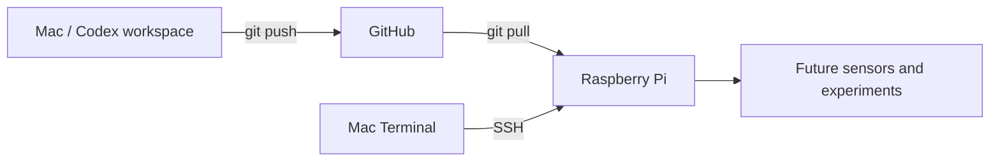
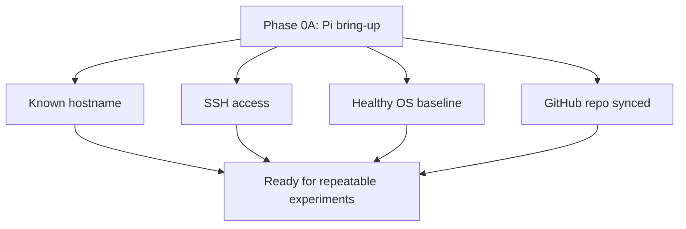

# 2026-07-13: Raspberry Pi Bring-Up

## Question

Can the Raspberry Pi 5 become the first always-on Signal Observatory computer?

More specifically:

- Can it boot headlessly?
- Can the Mac reach it over SSH?
- Does it have healthy storage, memory, temperature, and network access?
- Can it clone and sync the Signal Observatory GitHub repository?

## Setup

- Hardware: Raspberry Pi 5, 8 GB RAM
- Storage: 128 GB microSD card, about 117 GB usable after formatting
- Development machine: MacBook Pro
- Network: Wi-Fi, same local network as the Mac
- Hostname: `signal-observatory`
- Pi username: `lbernatm`
- Project path on Pi: `/home/lbernatm/Code/signalobservatory`
- Repository: `https://github.com/lucas-bernat/signalobservatory.git`

## Commands Or Procedure

The Raspberry Pi was flashed with Raspberry Pi OS Lite using Raspberry Pi Imager.

Important Imager settings:

```text
Device: Raspberry Pi 5
OS: Raspberry Pi OS Lite 64-bit
Hostname: signal-observatory
SSH: enabled
Wi-Fi: same SSID as the Mac
Raspberry Pi Connect: disabled for now
```

SSH connection from the Mac:

```bash
ssh lbernatm@signal-observatory.local
```

Health checks:

```bash
hostname
cat /etc/os-release
hostname -I
df -h
free -h
vcgencmd measure_temp
```

System update and reboot:

```bash
sudo apt update
sudo apt full-upgrade -y
sudo reboot
```

Development tools:

```bash
sudo apt install -y git curl wget vim htop python3 python3-venv python3-pip
git --version
python3 --version
pip3 --version
```

Repository clone and sync:

```bash
mkdir -p ~/Code
cd ~/Code
git clone https://github.com/lucas-bernat/signalobservatory.git
cd signalobservatory
git pull
git status
```

## Observations

The Pi is reachable on the local network:

```text
hostname: signal-observatory
IPv4 address: 192.168.4.52
```

Installed OS:

```text
PRETTY_NAME="Debian GNU/Linux 13 (trixie)"
VERSION_ID="13"
VERSION_CODENAME=trixie
DEBIAN_VERSION_FULL=13.5
```

Storage:

```text
/dev/mmcblk0p2  117G  5.2G  107G   5% /
/dev/mmcblk0p1  505M   90M  415M  18% /boot/firmware
```

Memory:

```text
Mem:   7.9Gi total, 415Mi used, 7.5Gi available
Swap:  2.0Gi total, 0B used
```

Temperature:

```text
Before reboot: temp=41.1'C
After reboot:  temp=45.0'C
```

Development tool versions:

```text
git version 2.47.3
Python 3.13.5
pip 25.1.1
```

Git status on the Pi:

```text
On branch main
Your branch is up to date with 'origin/main'.
nothing to commit, working tree clean
```

The Pi successfully pulled the Invisible Observatory platform docs:

```text
docs/vision/the-invisible-observatory.md
docs/architecture/modular-observatory-platform.md
docs/roadmap/invisible-observatory-roadmap.md
```

## Explanation

### Intuition

The Raspberry Pi is now the observatory's edge computer. In AV terms, it is like a rack processor installed at the measurement location: it does not need a local screen, but it needs stable power, network access, and a known control path.

The Mac remains the main development workstation. GitHub is the synchronization point between them.

### Vocabulary

- **Headless computer**: a computer operated without a directly attached monitor, keyboard, or mouse.
- **SSH**: Secure Shell, the remote terminal connection used to control the Pi from the Mac.
- **Hostname**: the network name of the Pi, here `signal-observatory`.
- **Local network**: the home Wi-Fi/router network shared by the Mac and Pi.
- **Repository clone**: a copy of the GitHub project on the Raspberry Pi.
- **Fast-forward pull**: Git updated the Pi's repo without conflicts because the Pi had no local changes.

### Visual



### Math

No signal-processing math yet. The useful numerical checks are resource baselines:

```text
Storage used percentage = 5%
Available RAM = 7.5 GiB of 7.9 GiB
Idle temperature = about 41-45 C
```

These are healthy bring-up values for a newly booted Raspberry Pi 5.

### Practical Consequence

The project can now use two machines cleanly:

| Machine | Role |
|---|---|
| Mac | Main coding, Codex collaboration, commits, GitHub push |
| Raspberry Pi | Edge computer for sensors, hardware tests, and future acquisition |
| GitHub | Shared source of truth |

The Pi should not become a mystery machine. Any future hardware state, package install, driver change, or measurement result should be logged.

### Experiment

The experiment was successful because:

1. The Pi booted without monitor/keyboard.
2. The Mac connected over SSH.
3. System health checks were normal.
4. Development tools were installed.
5. The Signal Observatory repository cloned and pulled successfully.

## Diagram Or Mental Model



## Mistakes Or Confusions

- The first SSH attempt used `lucas`, but the actual Pi username was `lbernatm`.
- The SSH password prompt showed no characters while typing. This is normal terminal behavior.
- After `sudo reboot`, SSH disconnected with `Connection reset by peer` and `Broken pipe`. This was expected because the Pi rebooted.
- Extra `$browser:control-in-app-browser` text appeared in the pasted prompt. It was not part of the Pi setup.

## Result

The Raspberry Pi is ready as the first Signal Observatory edge computer.

Evidence:

- Hostname resolves as `signal-observatory.local`.
- SSH works.
- OS is Debian GNU/Linux 13 on Raspberry Pi.
- Storage, RAM, and temperature are healthy.
- Git, Python, and pip are installed.
- The GitHub repository is cloned and clean on the Pi.
- The Invisible Observatory context is present on the Pi.

## Next Question

Before the RTL-SDR arrives, can the Pi run the existing synthetic signal experiments and produce the same outputs as the Mac?

