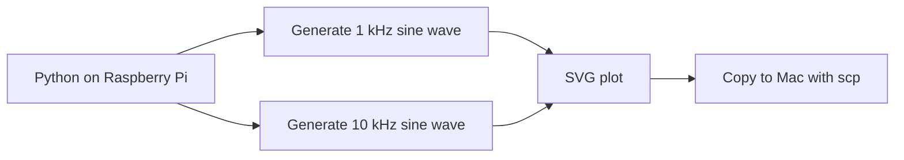
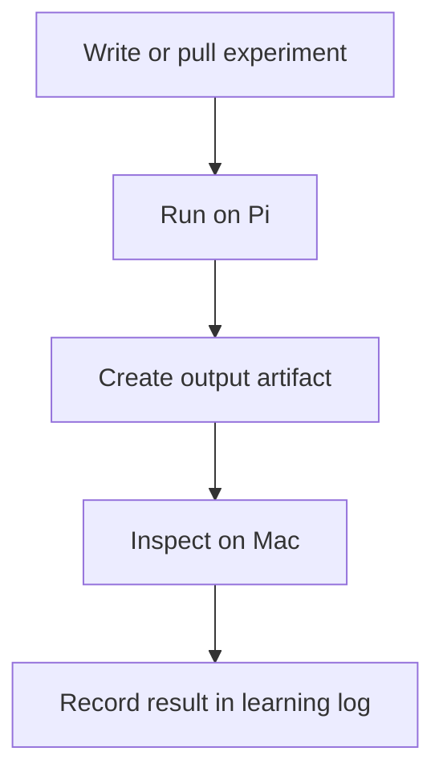
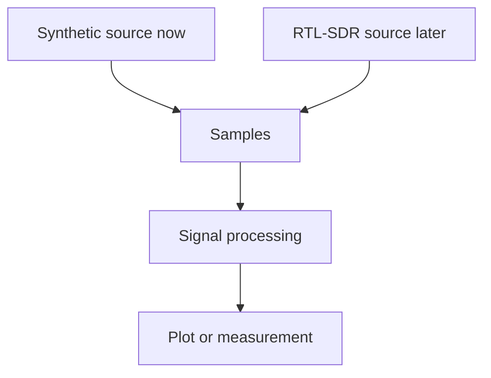

# 2026-07-14: Synthetic Signal Experiment On The Raspberry Pi

## Question

Before the RTL-SDR arrives, can the Raspberry Pi run a Signal Observatory experiment and create a useful signal artifact?

## Setup

- Hardware: Raspberry Pi 5, 8 GB RAM
- Hostname: `signal-observatory`
- Pi username: `lbernatm`
- Project path on Pi: `/home/lbernatm/Code/signalobservatory`
- Experiment: `experiments/01_sine_wave_frequency/plot_sine_waves.py`
- Output copied to the Mac Desktop using `scp`

## Commands Or Procedure

Run the synthetic sine-wave experiment on the Pi:

```bash
cd ~/Code/signalobservatory
python3 experiments/01_sine_wave_frequency/plot_sine_waves.py
ls experiments/output
```

The script produced:

```text
/home/lbernatm/Code/signalobservatory/experiments/output/01_sine_wave_frequency.svg
01_sine_wave_frequency.svg
```

Copy the SVG from the Pi to the Mac. This command must be run from the Mac terminal, not inside the Pi SSH session:

```bash
scp lbernatm@signal-observatory.local:/home/lbernatm/Code/signalobservatory/experiments/output/01_sine_wave_frequency.svg ~/Desktop/
```

## Observations

- The Raspberry Pi ran the Python experiment successfully.
- The experiment generated an SVG plot.
- The output file could be copied from the Pi back to the Mac.
- The generated plot showed a 1 kHz sine wave and a 10 kHz sine wave using the same sample rate and time window.

## Explanation

### Intuition

This was a dry run for instrumentation. The Pi did not measure the outside world yet, but it did behave like a small lab computer: run an experiment, create a result, and let us retrieve that result.

In AV terms, this is like testing a signal processor with an internal tone generator before plugging in microphones, receivers, or other real inputs.

### Vocabulary

- **Synthetic signal**: a signal generated by software instead of measured from hardware.
- **Time domain**: a view of how amplitude changes over time.
- **Frequency**: cycles per second, measured in hertz.
- **Artifact**: an output created by an experiment, such as a plot, image, log, capture file, or measurement table.
- **SCP**: Secure Copy, a command that copies files over SSH.

### Visual



### Math

Frequency means cycles per second:

```text
1 kHz  = 1,000 cycles/second
10 kHz = 10,000 cycles/second
```

The experiment used a 2 ms time window:

```text
1,000 cycles/second  * 0.002 seconds = 2 cycles
10,000 cycles/second * 0.002 seconds = 20 cycles
```

That is why the 10 kHz waveform appears more tightly packed than the 1 kHz waveform.

### Practical Consequence

The Pi can now run code that creates a repeatable signal-processing output. That means future experiments can use the same loop:



### Experiment

The experiment passed because the Pi generated the expected SVG file and the file was successfully copied to the Mac for inspection.

## Diagram Or Mental Model



The important mental model is that the signal source can change while the processing workflow remains familiar.

## Mistakes Or Confusions

- The first `scp` attempt was run from inside the Pi SSH session. That made the Pi try to copy the file from itself.
- The correct direction was Raspberry Pi to Mac, so `scp` had to be run from the Mac terminal.

## Result

Phase 0B passed.

Evidence:

- The Pi ran `experiments/01_sine_wave_frequency/plot_sine_waves.py`.
- The Pi created `experiments/output/01_sine_wave_frequency.svg`.
- The SVG was copied to the Mac and inspected.
- The time-domain frequency concept was visible in the plot.

## Next Question

Can the Pi convert a synthetic time-domain signal into a frequency-domain spectrum using an FFT?

