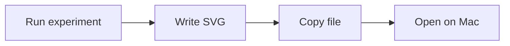
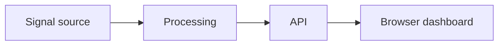
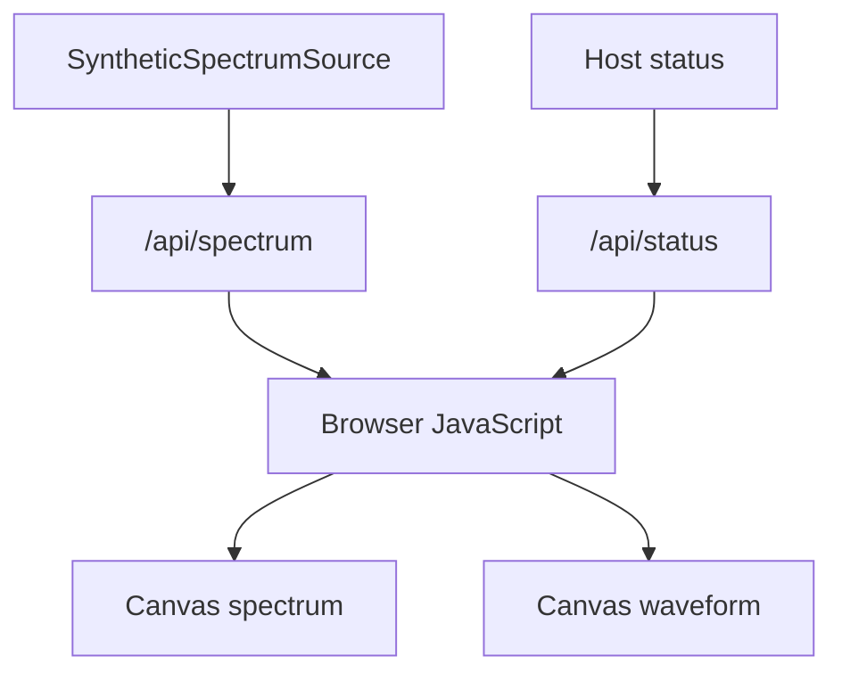
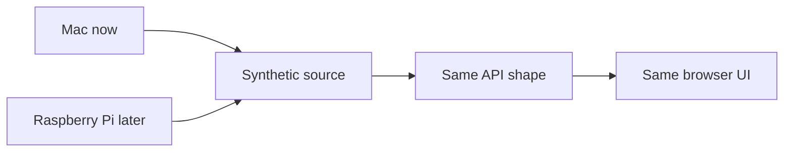

# 2026-07-14: Web Observatory MVP

## Question

Can Signal Observatory expose synthetic instrument data through a local web app instead of making us copy static image files around?

## Setup

- Development machine: MacBook Pro
- App path: `apps/observatory_web`
- Backend: Python standard-library HTTP server
- Frontend: HTML, CSS and JavaScript
- Data source: synthetic dual-tone spectrum source
- Local URL: `http://127.0.0.1:8000`

## Commands Or Procedure

Run the web app from the repository root:

```bash
python3 apps/observatory_web/server.py
```

Check the API:

```bash
curl http://127.0.0.1:8000/api/status
curl http://127.0.0.1:8000/api/spectrum
```

Open the dashboard:

```text
http://127.0.0.1:8000
```

## Observations

The status endpoint returned host/runtime information:

```text
name: Signal Observatory
source: synthetic-dual-tone
```

The spectrum endpoint returned:

```text
sample_rate_hz: 64000
fft_size: 4096
bin_spacing_hz: 15.625
```

The synthetic peaks were detected at the expected FFT bins:

```text
1 kHz  peak -> 1000.0 Hz at 0.0 dB
10 kHz peak -> 10000.0 Hz at about -6.0 dB
```

## Explanation

### Intuition

The previous workflow was file-based:



The new workflow is instrument-like:



This feels closer to an observatory. The instrument is running, and the browser asks it for the latest measurement frame.

### Vocabulary

- **Backend**: the server-side code that produces status and spectrum data.
- **Frontend**: the browser-side interface that renders the data.
- **API endpoint**: a URL that returns structured data instead of a full page.
- **Polling**: the browser asks for fresh data on a timer.
- **Frame**: one snapshot of measurement data.
- **Source interface**: the shape a data producer follows so synthetic, file-based and hardware sources can be swapped later.

### Visual



### Math

The first web dashboard uses the same FFT settings as Experiment 03:

```text
bin spacing = sample rate / FFT size
            = 64,000 / 4,096
            = 15.625 Hz
```

The tones land exactly on FFT bins:

```text
1,000 Hz  / 15.625 Hz = 64
10,000 Hz / 15.625 Hz = 640
```

The 10 kHz tone is half the amplitude of the 1 kHz tone. In dB:

```text
20 * log10(0.36 / 0.72) = -6.02 dB
```

That is why the 10 kHz peak appears about 6 dB lower than the 1 kHz peak.

### Practical Consequence

This creates the first stable app boundary:

```text
source -> API JSON -> browser rendering
```

Later, the source can change:

```text
SyntheticSpectrumSource -> RtlSdrSpectrumSource
```

The UI should not need to know which source produced the frame.

### Experiment

The experiment passed because:

1. The server started locally.
2. `/api/status` responded.
3. `/api/spectrum` responded.
4. The expected synthetic frequency peaks were present.
5. The browser UI can render the returned data as waveform and spectrum canvases.

## Diagram Or Mental Model



The useful mental model is that "live observatory" does not require SDR hardware yet. It requires a stable data path.

## Mistakes Or Confusions

- Starting a server inside the sandbox required elevated permission because binding a local port was blocked.
- A normal sandboxed `curl` could not reach the elevated local server, so the endpoint checks also had to run outside the sandbox.

## Result

Signal Observatory now has its first local web dashboard.

Evidence:

- `apps/observatory_web/server.py` serves static files and JSON endpoints.
- The browser UI fetches `/api/status` and `/api/spectrum`.
- The synthetic signal shows the same FFT peaks learned in Experiment 03.
- The app can run on the Mac now and on the Raspberry Pi later.

## Next Question

What should the source interface look like so synthetic data, recorded IQ files and future RTL-SDR data all feed the same web dashboard?

