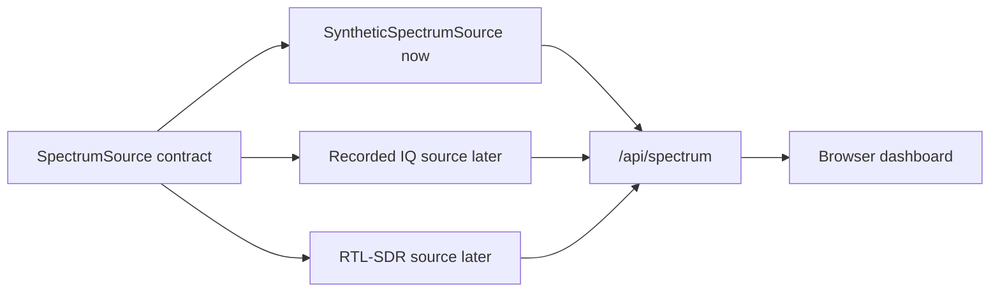
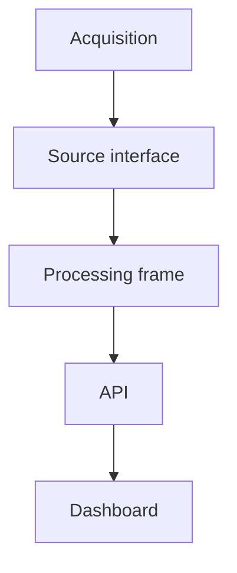

# 2026-07-15: Spectrum Source Interface

## Question

Can the web dashboard stop depending directly on the synthetic signal generator, so future sources can feed the same API and UI?

## Setup

- App: `apps/observatory_web`
- Current source: synthetic two-tone generator
- Future sources: recorded IQ files, RTL-SDR, other sensor modules
- Dashboard endpoint preserved: `GET /api/spectrum`

## Commands Or Procedure

Refactor the web app into a small source layer:

```text
apps/observatory_web/sources/
  base.py
  dsp.py
  synthetic.py
```

The server now creates a source:

```python
def create_source() -> SpectrumSource:
    return SyntheticSpectrumSource()
```

The HTTP handler still exposes:

```text
GET /api/status
GET /api/spectrum
```

## Observations

- `server.py` now handles HTTP routing and static file serving.
- `sources/base.py` defines the `SpectrumSource` contract.
- `sources/synthetic.py` owns synthetic signal generation.
- `sources/dsp.py` owns the dependency-free FFT helper.
- The browser API contract stays the same.

## Explanation

### Intuition

This is the same idea as separating an AV input from the display chain.

The display should not care whether the signal came from:

- a test tone,
- a playback file,
- a microphone,
- an RF receiver,
- or a future sensor.

It should care about the shape of the signal data it receives.

### Vocabulary

- **Source**: a thing that produces measurement data.
- **Interface**: the contract a source must follow.
- **Contract**: the expected shape and behavior other code can rely on.
- **Implementation**: one concrete source, such as a synthetic generator.
- **API stability**: keeping `/api/spectrum` the same even if the internal source changes.

### Visual



### Math

No new DSP math was added in this refactor.

The same FFT math still lives in the source layer:

```text
bin spacing = sample rate / FFT size
```

The architectural lesson is that the math and acquisition details now live behind the source contract.

### Practical Consequence

The next time we add a source, we should not need to rewrite the frontend. We should write another object that can return the same kind of spectrum frame:

```python
class NewSpectrumSource:
    name = "some-source"

    def snapshot(self) -> dict:
        ...
```

That makes the web dashboard a general instrument display instead of a synthetic-demo-only page.

### Experiment

The experiment is to verify that the dashboard still works after the refactor:

```bash
python3 -m py_compile apps/observatory_web/server.py
python3 apps/observatory_web/server.py --host 127.0.0.1 --port 8000
curl http://127.0.0.1:8000/api/spectrum
```

Expected evidence:

- API still returns `source: synthetic-dual-tone`.
- The 1 kHz and 10 kHz peaks still appear.
- Browser UI still renders without frontend changes.

## Diagram Or Mental Model



The key mental model is that acquisition is allowed to change, but the dashboard contract should remain steady.

## Mistakes Or Confusions

- The source interface is intentionally small right now. We are not adding a full plugin system yet.
- The API still returns plain dictionaries. That is acceptable for this stage because the goal is to preserve the data shape before adding heavier abstractions.

## Result

The dashboard now has a source boundary.

Evidence:

- Synthetic source code moved out of `server.py`.
- `server.py` imports `SyntheticSpectrumSource` through the source layer.
- The current API and frontend can keep using the same data shape.

## Next Question

Should the next source be a recorded IQ file source or the live RTL-SDR source once the hardware arrives?

