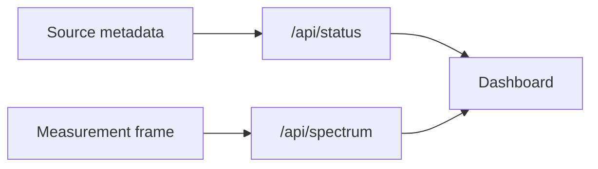

# 2026-07-15: Source Metadata In The Dashboard

## Question

How can the dashboard show what kind of signal source is feeding it without coupling the browser to one specific source implementation?

## Setup

- App: `apps/observatory_web`
- Source interface: `SpectrumSource`
- Current implementation: `SyntheticSpectrumSource`
- Dashboard endpoints:
  - `GET /api/status`
  - `GET /api/spectrum`

## Explanation

### Intuition

In AV terms, this is like labeling the input channel before looking at the meter.

A meter can show level, but you still want to know whether the signal is coming from a microphone, a test generator, playback, or a wireless receiver. The measurement and the source identity are related, but they are not the same thing.

### Vocabulary

- **Measurement data**: the changing values we plot, such as waveform samples and FFT bins.
- **Metadata**: descriptive information about the measurement, such as source name, mode, and hardware path.
- **Acquisition path**: how the samples entered the system.
- **Simulated source**: a source generated by software rather than physical hardware.

### Visual Model



The key separation is:

```text
/api/status   -> what is this instrument and source?
/api/spectrum -> what is the latest measurement frame?
```

### Equation

No new math was added.

The existing spectrum math is still:

```text
bin spacing = sample rate / FFT size
```

The new idea is architectural rather than mathematical.

### Practical Consequence

The dashboard can now show:

- source display name,
- source mode,
- acquisition path,
- hardware requirement,
- signal path.

Later, an RTL-SDR source can report different metadata while still returning the same spectrum frame shape.

```text
Synthetic metadata now:
  mode = Simulated
  hardware = No hardware required

RTL-SDR metadata later:
  mode = Live RF
  hardware = RTL-SDR V4
```

## Result

The dashboard now makes the source abstraction visible. This helps confirm that the current data is simulated, while preparing the same interface for recorded IQ files and live RTL-SDR samples later.
