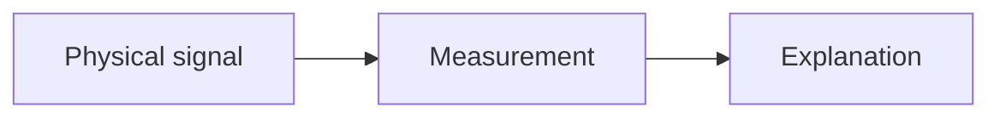

# Learning Log

Use this directory as the lab notebook for Signal Observatory.

The goal is not polished prose. The goal is to preserve the reasoning, commands, observations, and mental models developed while building the observatory.

## Entry Naming

Use dated filenames:

```text
YYYY-MM-DD-topic.md
```

Examples:

```text
2026-07-05-phase-0-usb-detection.md
2026-07-12-iq-sampling-first-mental-model.md
2026-07-19-first-fft.md
```

## Entry Template

````md
# YYYY-MM-DD: Topic

## Question

What am I trying to learn or prove?

## Setup

- Hardware:
- Software:
- Location:
- Antenna:
- Frequency or band:

## Commands Or Procedure

```bash
# Commands run during the experiment
```

## Observations

- What did I see?
- What changed when I adjusted settings?
- What surprised me?

## Explanation

What is my current understanding of why this happened?

When explaining a new concept, use this pattern:

1. Intuition: what is the everyday or AV-systems mental model?
2. Vocabulary: what are the exact technical terms?
3. Visual: what diagram, table, plot, or sketch makes it visible?
4. Math: what equation matters, if any?
5. Consequence: what changes in the measurement or code?
6. Experiment: how can I test it myself?

## Diagram Or Mental Model

Add a sketch, Mermaid diagram, table, plot, or ASCII chart that makes the concept visible.



## Mistakes Or Confusions

- What did I misunderstand?
- What did I assume incorrectly?

## Result

What can I now say with evidence?

## Next Question

What should I test next?
````

## Good Learning Log Habits

- Include exact commands when they matter.
- Note settings such as sample rate, center frequency, gain, FFT size, and window type.
- Add a diagram, chart, table, or mental-model sketch for every major concept.
- Keep failed attempts. They are often the most useful part.
- Write explanations in your own words after discussion.
- Prefer evidence over vibes.
