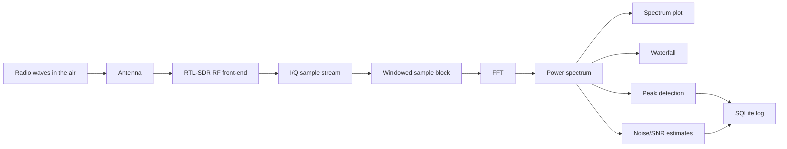
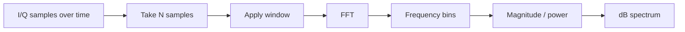
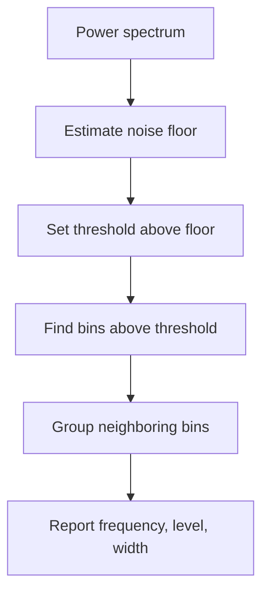
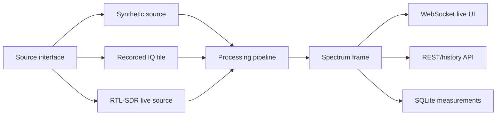

# Phase 1: Spectrum Analyzer

Phase 1 turns the observatory into its first real scientific instrument: a spectrum analyzer.

The goal is not merely to draw a pretty graph. The goal is to understand how invisible radio-frequency energy becomes samples, how samples become frequency bins, and how those bins become measurements.

Phase 1 is also the first module of the broader Invisible Observatory direction. Radio-specific learning and processing should remain inside the radio module, while persisted data should eventually fit the generic observatory model: Sensor, Measurement, DerivedMetric, CaptureSession, and Observation.

## Read This First

This file is the Phase 1 roadmap. Before implementing anything, read the detailed theory primer:

[SDR Spectrum Analyzer Theory Primer](../concepts/sdr-spectrum-analyzer-theory-primer.md)

Also read the broader platform direction when making architecture decisions:

- [The Invisible Observatory Vision](../vision/the-invisible-observatory.md)
- [Modular Observatory Platform Architecture](../architecture/modular-observatory-platform.md)

The primer explains the underlying concepts more slowly:

- signals, frequency, wavelength, and antennas
- RF tuning and baseband
- sampling and Nyquist
- I/Q samples
- FFT bins and frequency resolution
- windowing and leakage
- dB, noise floor, SNR, averaging, and overload
- spectrum vs waterfall
- peak detection
- REST vs streaming

## What You Will Build

At the end of Phase 1, the observatory should be able to:

- acquire I/Q samples from an RTL-SDR or from a recorded/synthetic source
- compute FFT-based spectra
- display a live spectrum
- display a waterfall
- estimate noise floor
- detect simple peaks
- log selected measurements to SQLite

The first implementation should be simple and explainable. Performance comes later.

## What You Will Learn

Phase 1 is where several AV, DSP, RF, and software concepts meet.

| Area | Concepts |
| --- | --- |
| RF | antenna, center frequency, tuner, bandwidth, gain, overload |
| Sampling | sample rate, Nyquist, complex samples, time windows |
| I/Q | quadrature, complex numbers, amplitude, phase |
| FFT | frequency bins, resolution, leakage, windowing |
| Measurement | dB, dBFS, noise floor, SNR, averaging |
| Visualization | spectrum plot, waterfall, time/frequency tradeoff |
| Software | acquisition loop, processing pipeline, streaming UI, storage |

## Phase 1 In One Picture



The important idea: the graph in the browser is the last step. The instrument starts at the antenna.

## The Scientific Question

Phase 1 should answer:

> What signals exist in this slice of spectrum, how strong are they, and how do they change over time?

That question breaks into smaller learning questions:

- What part of the RF spectrum am I observing?
- How wide is my observation window?
- What does each FFT bin represent?
- What counts as signal and what counts as noise?
- How do settings like gain, sample rate, and FFT size change the measurement?

## Signal Chain Mental Model

An AV signal chain might look like this:

```text
Microphone -> preamp -> ADC -> DAW -> meter/spectrogram
```

An SDR signal chain is similar:

```text
Antenna -> RF tuner/gain -> ADC -> I/Q samples -> FFT -> spectrum/waterfall
```

The main difference is that the SDR signal begins at radio frequency instead of audio frequency. The SDR shifts a selected RF band down into a form the computer can process.

## Center Frequency And Sample Rate

The SDR does not receive "all radio." It looks at a window around a center frequency.

```text
Example:

center_frequency = 100.0 MHz
sample_rate      =   2.4 MS/s

Observed span is approximately:

98.8 MHz                  100.0 MHz                  101.2 MHz
  |--------------------------|--------------------------|
        lower half-band             upper half-band

Total visible width is about 2.4 MHz.
```

Key idea:

```text
frequency span ~= sample rate
frequency bin width = sample rate / FFT size
```

Example:

```text
sample_rate = 2,400,000 samples/s
FFT size    = 4096 samples

bin width = 2,400,000 / 4096
          ~= 586 Hz per bin
```

That means each FFT bin represents a narrow slice of frequency about 586 Hz wide.

## Why I/Q Samples Exist

Audio samples are usually real numbers:

```text
sample[n] = amplitude at time n
```

SDR samples are usually complex numbers:

```text
sample[n] = I[n] + jQ[n]
```

I and Q are two views of the same signal, 90 degrees apart in phase.

```text
                  Q
                  ^
                  |
             .    |    rotating sample vector
          .       |
       .          |
  ----------------+----------------> I
                  |
                  |
                  |
```

Why this matters:

- I/Q preserves amplitude and phase.
- I/Q can represent signals above and below the tuned center frequency.
- I/Q lets the SDR describe a band around a center frequency without losing direction.

Useful mental model:

```text
Real samples: "how loud is it right now?"
I/Q samples: "how loud is it and what phase direction is it rotating?"
```

## From Samples To Spectrum

An FFT converts a block of time-domain samples into frequency-domain bins.



The FFT asks:

> How much of each frequency is present inside this block of samples?

## Time Resolution Vs Frequency Resolution

Longer FFT blocks give narrower frequency bins, but they update more slowly.

```text
Short FFT block

time:      [------]
result:    fast updates, coarse frequency detail

Long FFT block

time:      [------------------------------]
result:    slower updates, finer frequency detail
```

Tradeoff:

| FFT size | Frequency detail | Time responsiveness |
| --- | --- | --- |
| small | coarse | fast |
| large | fine | slower |

This is the same family of tradeoff you know from audio spectrograms.

## Windowing And Spectral Leakage

The FFT assumes the sample block repeats forever. If the block begins and ends abruptly, energy can smear into nearby bins. That smear is spectral leakage.

Without a window:

```text
time block:

| sudden start                 sudden end |
|    /\/\/\/\/\/\/\/\/\/\/\/\/\/          |

spectrum:

main peak with extra side energy
```

With a Hann window:

```text
time block:

| fade in    steady middle     fade out |
|    .-''''''''''''''''''''-.          |

spectrum:

cleaner peak shape, less leakage
```

The window changes the measurement slightly, but it usually makes the spectrum easier to interpret.

## Power, dB, Noise Floor, And SNR

The spectrum plot usually shows power in decibels.

```text
Power spectrum

dB
^
|                       signal peak
|                          /\
|                         /  \
|                        /    \
|----------------------/------\----------  noise floor
|
+------------------------------------------------> frequency
```

Key terms:

- noise floor: the baseline energy level when no strong signal is present
- peak: a frequency bin or group of bins clearly above the floor
- SNR: signal-to-noise ratio, usually in dB

Simple visual:

```text
SNR = peak level - noise floor

peak level:    -32 dB
noise floor:   -58 dB

SNR:            26 dB
```

Early measurements will be relative, not laboratory-calibrated absolute RF power. That is okay. We can still learn a lot.

## Spectrum Vs Waterfall

A spectrum is one moment in time.

```text
power
^
|       /\       /\
|      /  \     /  \
|_____/____\___/____\________> frequency
```

A waterfall stacks many spectra over time.

```text
newest time
  |
  v

freq ->  98.8      100.0      101.2 MHz
        --------------------------------
t0      ..::....####....::.............
t1      ..::....####....::.............
t2      ........####...................
t3      ..........##......%%%%.........
t4      ..................%%%%.........

brightness/color = power
```

The waterfall teaches a different skill: recognizing signals by behavior over time, not just by frequency.

## Peak Detection

The first peak detector should be deliberately simple.



Example:

```text
threshold = noise_floor + 12 dB
```

This will not classify signals yet. It only says, "something is here."

## Software Shape

The first software architecture should separate acquisition from processing.



The key design lesson:

> Modularity comes from clean interfaces, not from making everything a separate service.

## Learning Sequence

Do not start with the live web app.

Start here:

1. Generate synthetic I/Q samples.
2. Plot their FFT offline.
3. Change sample rate and FFT size.
4. Add windowing and compare leakage.
5. Add noise and measure SNR.
6. Load a short recorded I/Q file.
7. Process live RTL-SDR samples.
8. Stream spectrum frames to the browser.
9. Add waterfall display.
10. Add simple peak detection and SQLite logging.

## Experiments Before The App

Suggested experiment files when we begin coding:

```text
experiments/
    01_complex_tone/
    02_fft_bins/
    03_windowing_leakage/
    04_noise_floor_snr/
    05_recorded_iq_fft/
```

Each experiment should produce:

- one script or notebook
- one plot
- one learning-log entry

## Phase 1 Exit Questions

Before Phase 1 is considered complete, you should be able to answer:

- What is an I/Q sample?
- Why does the SDR use a center frequency?
- What does sample rate control?
- What does FFT size control?
- Why do we use a window function?
- What is spectral leakage?
- What is a noise floor?
- How is SNR estimated from a spectrum?
- What is the difference between a spectrum and a waterfall?
- Why should live display use streaming rather than plain REST polling?

## What Comes After Phase 1

Phase 2 should not begin until the spectrum analyzer is understandable and trustworthy. Signal intelligence only makes sense after the measurement instrument is working.

Phase 2 can then ask:

> Can the observatory detect, summarize, and compare signals over time?

That is a higher-level question, built on the Phase 1 foundation.
