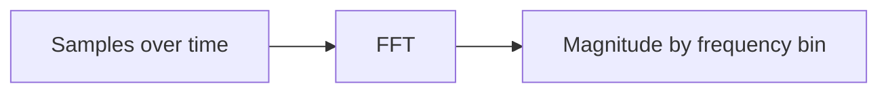
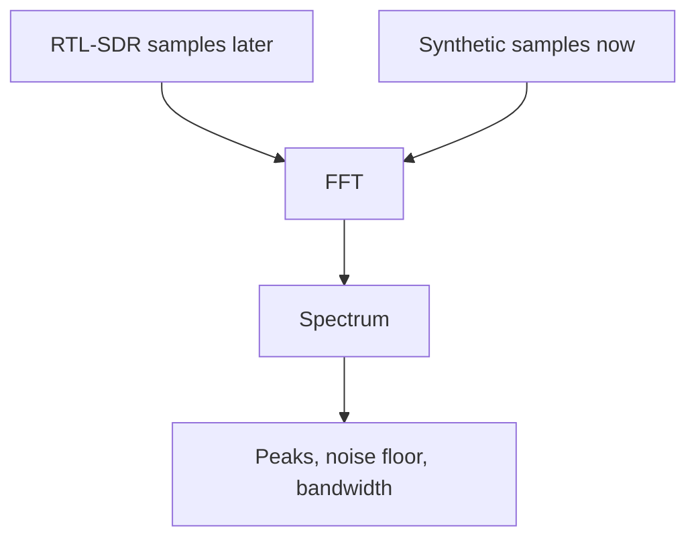

# Experiment 03: FFT Spectrum

## Question

If a time-domain signal contains a 1 kHz tone and a 10 kHz tone at the same time, can an FFT reveal both frequencies?

## Concept

A waveform shows amplitude over time.

A spectrum shows amplitude by frequency.

The FFT is the tool that translates between those views:



## Run

From the repository root:

```bash
python3 experiments/03_fft_spectrum/plot_fft_spectrum.py
```

The script writes:

```text
experiments/output/03_fft_spectrum.svg
```

It also prints the FFT bin spacing and the detected bins near the two generated tones.

## Settings

```text
sample rate: 64,000 samples/second
FFT size:    4,096 samples
bin spacing: 15.625 Hz
tone 1:      1,000 Hz
tone 2:      10,000 Hz
noise:       small deterministic noise floor
```

The bin spacing comes from:

```text
bin spacing = sample rate / FFT size
            = 64,000 / 4,096
            = 15.625 Hz
```

The two tones were chosen to land exactly on FFT bins:

```text
1,000 Hz  / 15.625 Hz = 64
10,000 Hz / 15.625 Hz = 640
```

That keeps the first FFT experiment visually clean. Later experiments can intentionally choose frequencies that do not land on a bin so we can study spectral leakage and windowing.

## What To Notice

- The time-domain plot looks like one complicated waveform.
- The frequency-domain plot reveals two clear peaks.
- The strongest peak is the 1 kHz tone.
- The smaller peak is the 10 kHz tone because its amplitude is lower.
- The tiny random noise creates a low baseline, which is the first mental model for a noise floor.

## Why This Matters For SDR

An SDR gives us samples. A spectrum analyzer takes chunks of those samples, runs an FFT, and draws frequency peaks.



This experiment proves the Pi can run the same core transform that a future live spectrum analyzer will use.
